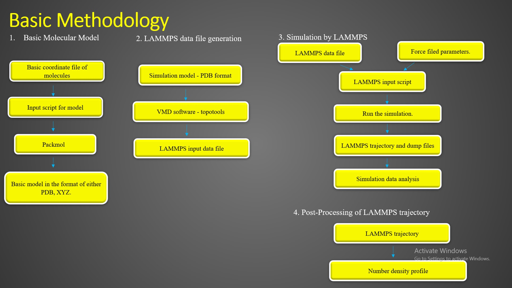
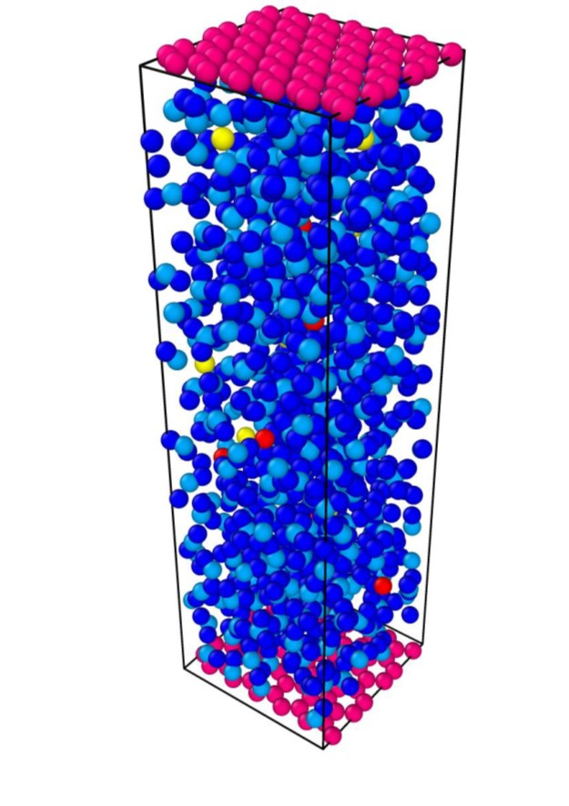
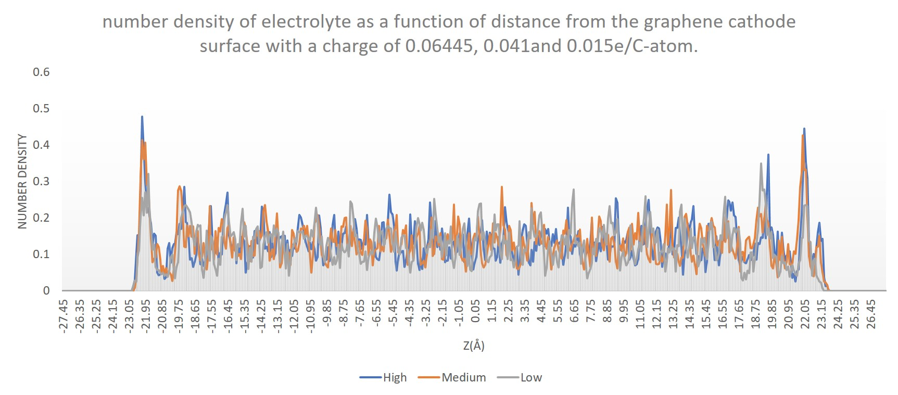

# Molecular Dynamics Simulations of a Electrode- eletrolyte Interface

The research for renewable energy generation methods require development for new energy storage methods. The advancement of supercapacitor applications is improved by achieving high surface which is correlated to increase the energy storage of the device.
Molecular Dynamic (MD) simulation method was performed to understand the interface phenomenon of the graphene based electrode-electrolyte system and investigated the molecular structures of Electric Double layer structure at the interface.  
Simulation methodology was developed using planar electrode model and quantitative measured the variation of the electrolyte density along the Z direction of the simulation cell. Ion separation of the electrolyte during the simulation time and Charge density profile along Z direction were studied. 

 This project showed us that the modeling of material interfaces could be challenging even for someone with a background in atomic simulations. Therefore, we would like to share some useful information and the LAMMPS input files to model the graphene eletrolyt system shown below. 

 <!-- A movie of the simulation is [available here](https://youtu.be/Nx7B1W6U_m8). -->

# Methodology:

## software and tool

1. [PACKMOL](https://m3g.github.io/packmol/) - Initial configuration for Molecular Dynamic simulation by Molecular optimization.
2. VMD - Visual Molecular Dynamics
3. VESTA - Visualization for Electronic Structural Analysis
4. LAMMPS -  Large-scale Atomic/Molecular Massively Parallel Simulator
5. OVITO - Open-Source Visualization Software

 

Initial structure was created using PACKMOL. The structure of the supercapacitor  shown in the above video can be depicted as below.

 

# Energy Fluctuation of the system

Total energy, Potential, and kinetic energy fluctuation curve with respect to the simulation time. The equilibration of the system is confirmed by the steady average values of energy. These graphs were obtained by running a molecular dynamic system in an NVE ensemble(without any thermostat or barostat)
for a few picoseconds.

 

I used [OVITO](https://www.ovito.org/) to visulalize MD tragectories of this simulation. A great introductory tutorial about OVITO is [available here](https://youtu.be/z4rogk8pdt4). [VMD](https://www.ks.uiuc.edu/Research/vmd/vmd-1.9.3/) is another very useful visualization tool. 

[Movie2.mp4](assets%2FMovie2.mp4)

I hope that this information and the LAMMPS files will be useful for those who are interested in modeling of material interfaces. Good luck!

# References
[1] 	C. B. M. P. A. S. P. S. M. Merlet, “Simulating Supercapacitors: Can We Model Electrodes As Constant Charge Surfaces?,” The Journal of Physical Chemistry Letters, vol. 4, no. 2, pp. 264-268, 2013. 

[2] 	G. C. C. L. D. L. J. Z. Jiang, “Molecular dynamics simulations of the electric double layer capacitance of graphene electrodes in mono-valent aqueous electrolytes,” Nano Research, vol. 9, no. 1, pp. 174-186, 2016. 

[3] 	J. Z. a. L. L. a. L. S. a. Z. D. a. W. Z. a. Z. Weng, “Electric double-layer of [emim][DCA] ionic liquid at heterogeneous interface of TiO2/C composite: From simulation to experiment,” Electrochimica Acta, vol. 341, p. 135981, 2020. 	

